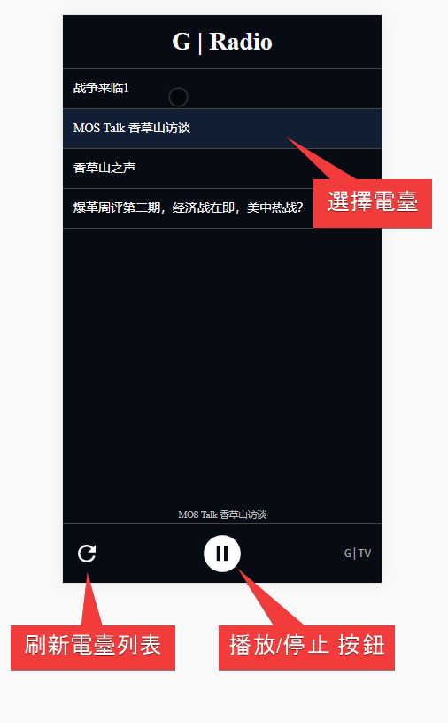

###  [:newspaper:GNews](https://github.com/ourhimalayas/txt) | [:tv:蓋特](https://github.com/ourhimalayas/txt/blob/master/content/getter/README.md) | [:books:視頻文字](https://github.com/ourhimalayas/txt/blob/master/content/README.md) | [:radio: 廣播](https://github.com/ourhimalayas/txt/blob/master/content/docs/g-radio/README.md) | [:pray:關於](https://github.com/ourhimalayas/home/tree/master/about)
---

## G|Radio
喜歡聼廣播？G|Radio 可以讓您收聽G|TV直播！

無需安裝，使用地址： https://ourhimalayas.github.io/g-radio/

**備注**
* 此應用為非官方發佈的軟件
* 以廣播形式收聽直播節目，如果您的網絡沒問題，請直接使用 [G|TV 官方網站](https://gtv.org)

### 使用方式

* 在刷新列表或者播放電臺時候，如果遇到網絡故障，請重複刷新或者點擊電臺重試。

### 使用問題
請提交到：
https://github.com/ourhimalayas/g-radio/issues
